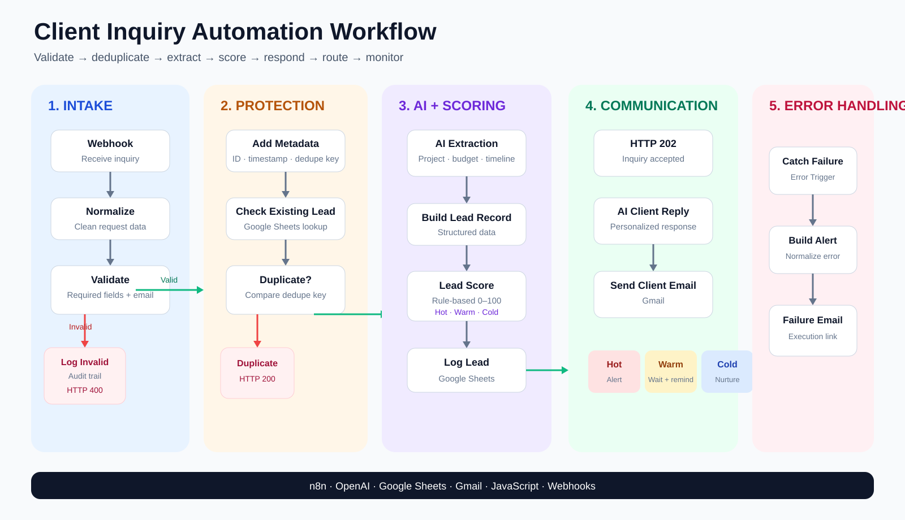
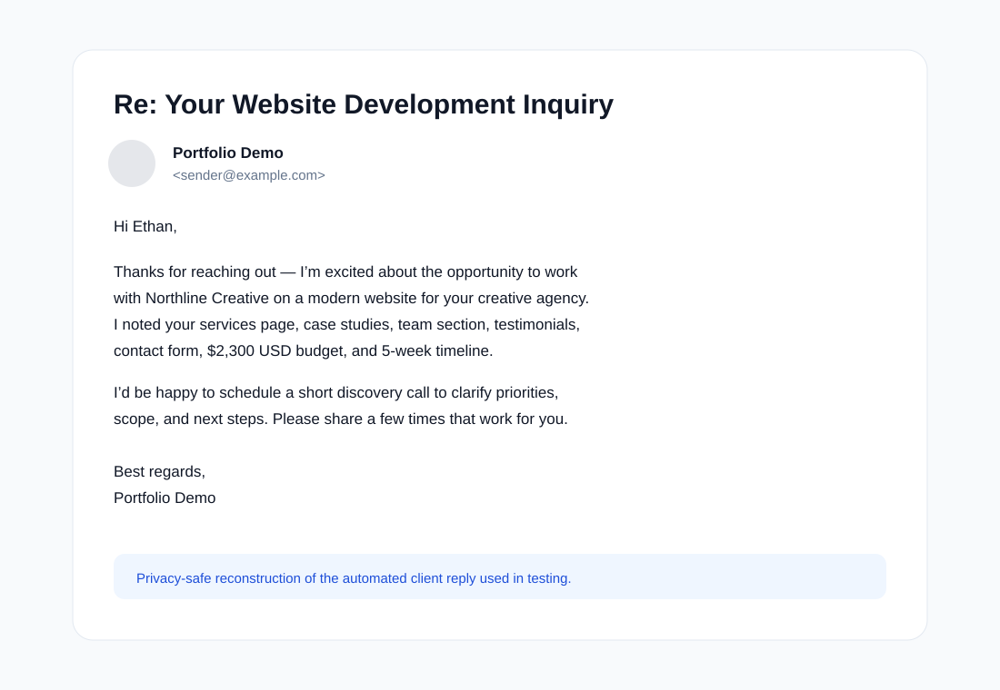
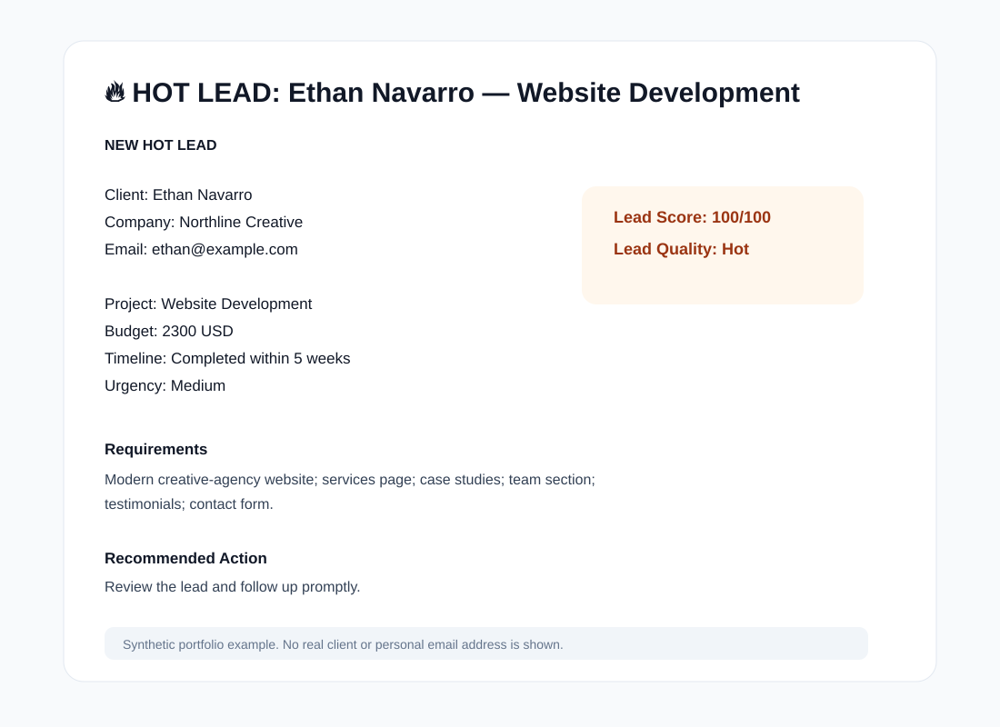
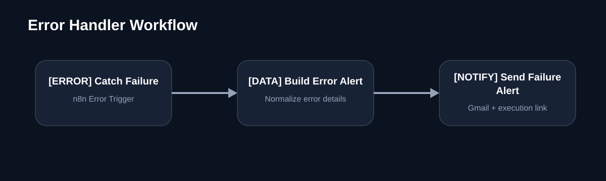

# AI-Powered Client Inquiry & Lead Qualification Automation

An end-to-end **n8n** workflow that receives client inquiries, validates and deduplicates submissions, uses AI to extract project requirements, calculates an explainable lead score, stores leads in Google Sheets, generates personalized email replies, and routes leads based on qualification level.

> **Portfolio project:** built to demonstrate practical workflow automation, AI-assisted data extraction, deterministic business logic, API/webhook handling, validation, deduplication, notifications, and error monitoring.

## What It Solves

Manually reviewing every client inquiry takes time and makes it easy to miss high-value leads. This workflow automates the intake process while keeping critical business decisions explainable.

It can:

- validate required inquiry fields and email format
- reject invalid submissions before AI processing
- prevent duplicate inquiries before any LLM call
- extract structured project information from free-form messages
- calculate a deterministic lead score from 0–100
- classify leads as **Hot**, **Warm**, or **Cold**
- log leads in Google Sheets
- return clear HTTP responses for valid, invalid, and duplicate requests
- generate personalized client replies
- send immediate alerts for Hot leads
- delay and remind the owner about Warm leads
- store Cold leads in a nurture queue
- log invalid submissions for auditing
- retry safe external operations
- trigger a separate workflow-failure alert when the main automation fails

## Tech Stack

| Tool | Purpose |
| --- | --- |
| **n8n** | Workflow orchestration |
| **OpenAI GPT-5 Mini** | Inquiry extraction and personalized reply generation |
| **Google Sheets** | Lead database, nurture queue, validation logs |
| **Gmail** | Client replies and internal notifications |
| **Webhooks** | External inquiry endpoint |
| **JavaScript** | Validation support, scoring logic, metadata, error normalization |

## Architecture

The workflow is intentionally split into clear stages:

1. **Intake** — receive and normalize inquiry data
2. **Validation** — verify required fields and email format
3. **Protection** — add metadata and detect duplicates before AI usage
4. **AI Processing** — extract structured project details
5. **Qualification** — calculate an explainable score using deterministic rules
6. **Storage** — log the lead to Google Sheets
7. **Communication** — acknowledge the request and generate a personalized reply
8. **Routing** — trigger different actions for Hot, Warm, and Cold leads
9. **Monitoring** — notify the owner when a workflow execution fails

### High-Level Flow

~~~mermaid
flowchart LR
    A[Website / Client Form] --> B[Webhook Intake]
    B --> C[Normalize Data]
    C --> D{Valid Submission?}
    D -- No --> E[Log Invalid Submission]
    E --> F[HTTP 400]
    D -- Yes --> G[Add Intake Metadata]
    G --> H[Check Existing Lead]
    H --> I{Duplicate?}
    I -- Yes --> J[HTTP 200 Duplicate]
    I -- No --> K[AI: Extract Inquiry Details]
    K --> L[Build Lead Record]
    L --> M[Deterministic Lead Scoring]
    M --> N[Log Lead to Google Sheets]
    N --> O[HTTP 202 Accepted]
    N --> P[AI: Generate Client Reply]
    P --> Q[Send Client Email]
    P --> R{Lead Quality}
    R -- Hot --> S[Immediate Hot Lead Alert]
    R -- Warm --> T[Wait 1 Day]
    T --> U[Warm Lead Reminder]
    R -- Cold --> V[Nurture Queue]
~~~

A separate error workflow monitors unhandled execution failures:

~~~mermaid
flowchart LR
    A[Workflow Failure] --> B[Error Trigger]
    B --> C[Build Error Alert]
    C --> D[Send Failure Notification]
~~~

## Lead Scoring

AI interprets the inquiry, but **AI does not decide whether the lead is good or bad**.

Lead quality is calculated with deterministic JavaScript rules:

| Signal | Points |
| --- | ---: |
| Complete contact information | +10 |
| Clear project type | +25 |
| Budget amount provided | +15 |
| Budget currency provided | +10 |
| Project timeline provided | +20 |
| Detailed requirements | +20 |
| **Maximum** | **100** |

Classification:

~~~text
80–100  → Hot
50–79   → Warm
0–49    → Cold
~~~

The workflow stores the reasons behind the score, making qualification explainable and easier to audit.

## Lead Routing

### Hot Lead
- client receives a personalized email
- owner receives an immediate priority alert
- alert includes project details, lead score, requirements, and original inquiry

### Warm Lead
- client receives a personalized email
- workflow waits one day
- owner receives a follow-up reminder

### Cold Lead
- client receives a personalized email
- lead is stored in a separate nurture queue for future outreach

## API Responses

| Scenario | HTTP Status | Behavior |
| --- | --- | --- |
| Valid new inquiry | 202 Accepted | Lead is accepted and downstream processing continues |
| Duplicate inquiry | 200 OK | Existing inquiry is detected; AI and downstream actions are skipped |
| Invalid submission | 400 Bad Request | Missing or malformed input is logged and reported |

## Duplicate Prevention

A normalized deduplication key is generated from the client email plus the normalized inquiry message.

The lead database is checked **before the AI extraction step**. Repeated submissions stop early, helping prevent duplicate spreadsheet rows, emails, notifications, and unnecessary AI/API usage.

## Validation

The workflow checks that the client name, client email, and inquiry message are present, and that the email matches a basic format.

Invalid submissions are logged to a dedicated sheet with missing fields, validation issues, validation reason, and rejection timestamp.

## Reliability & Error Handling

Safe read/generation operations use retry-on-failure where appropriate.

A separate n8n error workflow captures unhandled failures and creates an internal alert containing:

- workflow name
- failed node
- error message
- execution ID
- execution link
- failure mode
- timestamp

Write/send actions are handled conservatively to reduce the risk of duplicate rows or duplicate emails.

## Example Outputs

### Personalized Client Reply

### Hot Lead Internal Alert

### Error Handler

## Repository Structure

~~~text
n8n-ai-lead-qualification-automation/
├── README.md
├── SECURITY.md
├── assets/
│   ├── workflow-architecture.svg
│   ├── client-reply-example.svg
│   ├── hot-lead-alert-example.svg
│   └── error-handler.svg
├── docs/
│   ├── ARCHITECTURE.md
│   ├── TESTING.md
│   ├── DEMO.md
│   ├── CASE-STUDY.md
│   ├── PORTFOLIO-COPY.md
│   └── INTERVIEW-NOTES.md
├── sample-data/
│   └── test-payloads.json
└── workflows/
    └── README.md
~~~

## Tested Scenarios

The workflow was tested with controlled sample data for successful Hot lead processing, Warm lead delayed follow-up, Cold lead nurture routing, missing required fields, invalid email format, duplicate blocking, HTTP responses, workflow failure alerts, and client reply delivery to a separate test inbox.

See [docs/TESTING.md](docs/TESTING.md) for the test matrix.

## Security & Privacy

This repository intentionally excludes API keys, credentials, OAuth secrets, private webhook URLs, real client records, personal test email addresses, and account-specific n8n identifiers.

All names, companies, email addresses, and examples in the documentation are synthetic demo data.

See [SECURITY.md](SECURITY.md).

## AI-Assisted Development

This project was developed with AI-assisted guidance for planning, debugging, documentation, and reviewing implementation decisions.

The workflow itself was manually configured, tested, debugged, and validated in n8n, including node configuration, data mapping, JavaScript business logic, lead-scoring rules, conditional routing, webhook/API testing, integrations, failure handling, and production smoke testing.

AI is also intentionally used **inside the finished automation** for information extraction and personalized response generation, while critical business decisions such as lead scoring and routing remain rule-based and explainable.

## Documentation

- [Architecture & design decisions](docs/ARCHITECTURE.md)
- [Testing strategy and test matrix](docs/TESTING.md)
- [Demo walkthrough](docs/DEMO.md)
- [Project case study](docs/CASE-STUDY.md)
- [Portfolio / CV copy](docs/PORTFOLIO-COPY.md)
- [Interview talking points](docs/INTERVIEW-NOTES.md)
- [Setup / recreation guide](docs/SETUP.md)
- [Workflow export notes](workflows/README.md)
- [Synthetic test payloads](sample-data/test-payloads.json)
- [PowerShell webhook test helper](sample-data/test-webhook.ps1)

## Current Status

**Version 1: complete and tested.**

The core workflow is intentionally frozen after end-to-end production testing so the project remains focused and explainable instead of accumulating unnecessary features.
